# Week 21 RevoU Assignment
***

## Hello!
This is an Backend of a Tweet app using Flask as a Python Framework 
 
## API Available
### /auth/register

**Status Code 200** if user are new 
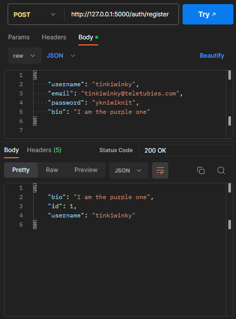

**Status Code 400** if user are using the same username
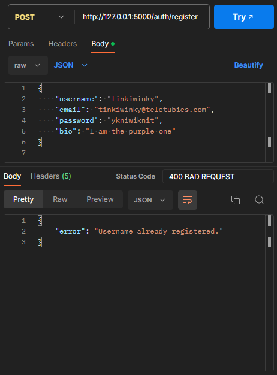

**Status Code 400** if user are using the same email
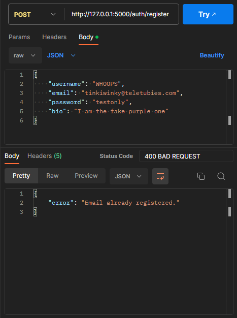
***

### /auth/login

**Status Code 200** if user login without problem 
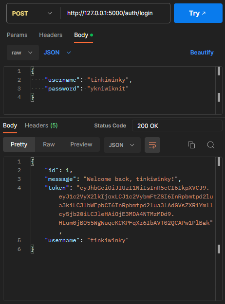

**Status Code 400** if user type wrong username or password
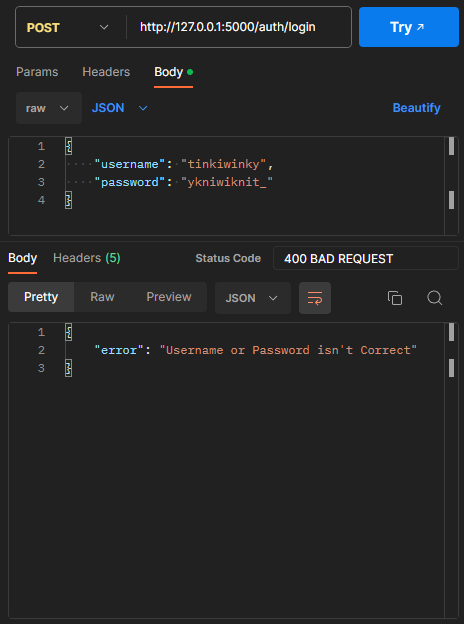
***

### /tweet

**Status Code 200** POST for tweet always needs ***Token for Authorization*** 
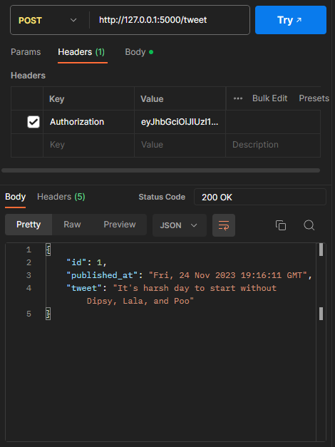

and also ***JSON body*** for the tweet text content
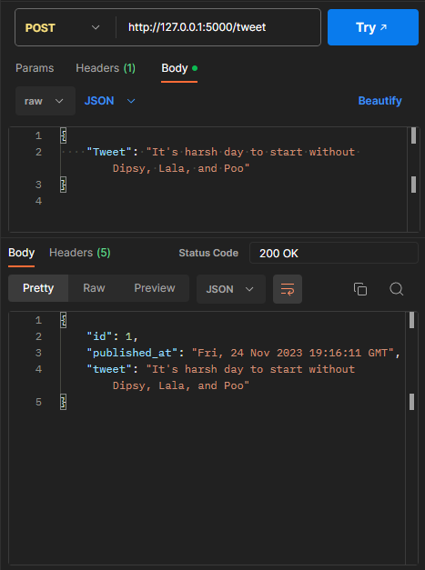

**Status Code 400** if the tweet is having an issues, for example: ***has no text in the JSON***
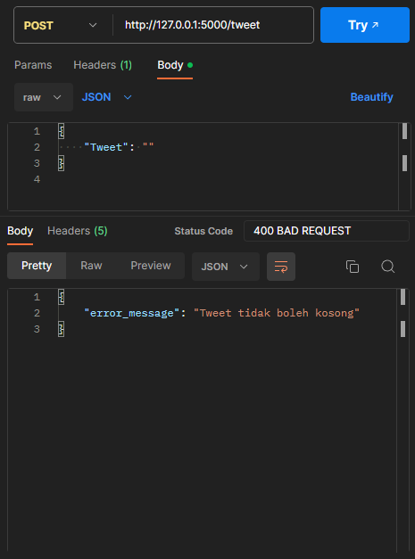

or ***typing more than 150 characters***
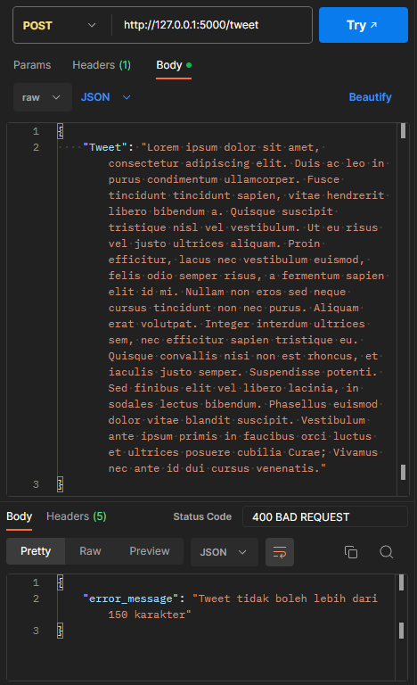
***

### /follow

**Status Code 200** POST for follow other user need ***Token for Authorization*** and a ***JSON body*** just like the code below
 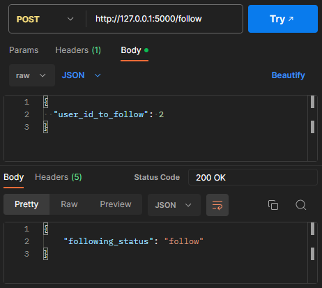

if send it again it will change the status back to **"unfollow"**

***

### /user

**Status Code 200** GET for user to check up the user profile
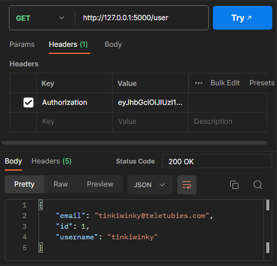

**Status Code 401** will appear if the 1 minute time given for the Token Authorization was abandoned and the user must login again to receive new token
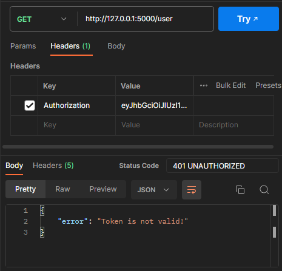

***

## Deployment
postman deployed link for this app be is here https://documenter.getpostman.com/view/28996075/2s9YeD8DHj

## THANKYOU
Thankyou for visiting

